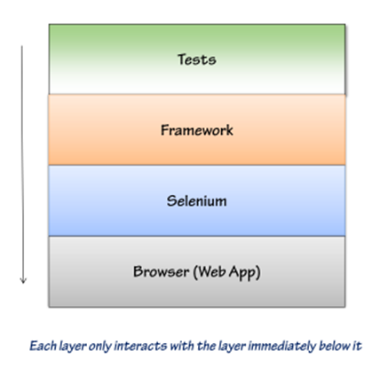

# Testes Automatizados
---

## Introdução

Projeto de Testes Automatizados baseados em um arquitetura de FrameWork.
+ Command Line
+ GUI
+ Web app


### Por quê?
[Link: Por que utilizar a arquitura de FrameWork para Testes Automatizados?](https://simpleprogrammer.com/2014/04/14/test-automation-framework-architecture/)

## Projeto de Camadas


  

  Com esse tipo de separação, podemos isolar os nossos casos de Teste da ferramenta de testes (*Selenium*). Caso o Selenium não nos satisfaça mais, podemos alterar o frameWork sem que haja perda nos casos de teste já escritos.

## Solução

A Solução base da nossa solução vem do repositório: [Repositório Base](https://github.com/jsonmez/BATDemo)

Solução Visual Studio com os projetos:
 - TopDown_QA_FrameWork (*.sln*)
  - TopDown_QA_FrameWork (*.csproj*)
  - Testes_TopDown (*.csproj*)


## Regras

Alguns GuideLines para criar / projetar um bom FrameWork de Testes Automatizados.


  - NUNCA exija que o testador declare variáveis.

  - NUNCA exija que o testador use a palavra-chave *new* ou crie novos objetos.

  - NUNCA exija que o testador gerencie o estado por ele mesmo.

  - SEMPRE reduza o número de parâmetros para a chamada de APIs quando possível.

  - SEMPRE utilize valores padrão ao invés de requerer parâmetros quando possível.

  - PREFIRA fazer a API mais fácil de usar ao invés de fazer chamadas internas da API menos complexas.

  - PREFIRA usar *enums* e constantes para exigir o teste passar usando tipos primitivos.

  - NUNCA exponha o browser ou DOM para os testes ou deixe que o manipule diretamente.

### Testes Unitários

> *TODO*

### Testes de Integração

> *TODO*

### Testes de Sistemas

> *TODO*

### Ciclo de Vida do Teste

> *TODO*


### Escrevendo um Caso de Teste

> *TODO*

### Inserindo Novas Funcionalidades

> *TODO*

### Page Object Model (POM)

> *TODO*

### Planejamento do Teste

> *TODO*

### Testando MultiBrowser

> *TODO*


## Geradores

Conjunto de ferramentas utilizadas para gerar dados aleatórios, válidos para o problema.

## Padrões

### Logger

Para escrever no log de forma padronizada e ajudar na descrição dos casos de sucesso e fracasso dos casos de teste de forma detalhada:

```C#
string frameDesejado = "FRAME QUE VAI SER ACESSADO";

Logger.escrever("[" + Browser.getSourceFromFrame(frameDesejado) + "] " + "Indo para Gestão Prestador > Cadastro Prestador > Inclusão: Informando Vinculação");

```

### CTF (Escritor)

Um dos objetivos do teste automatizado é a escrita automatizada dos casos de teste. A partir da execução dos testes é gerado o CTF correspondente.

Para isso para cada função que representa um caso de teste, segue o exemplo:

```C#
#region TestTemplate
 [Test]
 [Description("Descrição do Teste")]
 [Property("Nome", "Nome do Teste (também nome do arquivo)")]
 [Property("Módulo", "Autenticação")]
 [Property("Função", "Login")]
 [Property("Pré Condição", "")]
 [Property("Pós Condição", "Usuário Garante Acesso Ao Sistema")]
 [Property("Ambiente", "Browser:IE10\tWeb:10.10.100.147\tBD:Homo_Med")]
 [Property("Versão", "11")]
 [Property("SAC", "N/A")]
 [Property("Responsável", "PETERSON ANDRADE")]
 public static void ConsegueLogar()
 {


     #region Cabeçalho CTF
     CTF.Iniciar(TestContext.CurrentContext.Test.Properties.Get("Nome").ToString());
     CTF.InformacoesIniciais(
         TestContext.CurrentContext.Test.Properties.Get("Módulo").ToString(),
         TestContext.CurrentContext.Test.Properties.Get("Função").ToString(),
         TestContext.CurrentContext.Test.Properties.Get("Pré Condição").ToString(),
         TestContext.CurrentContext.Test.Properties.Get("Pós Condição").ToString(),
         TestContext.CurrentContext.Test.Properties.Get("Ambiente").ToString(),
         TestContext.CurrentContext.Test.Properties.Get("Versão").ToString(),
         TestContext.CurrentContext.Test.Properties.Get("SAC").ToString(),
         TestContext.CurrentContext.Test.Properties.Get("Responsável").ToString(),
         DateTime.Today.ToString(@"DD/MM/YYYY"));
     //
     #endregion

     try
     {
         #region Passos do Caso de Teste
         //TODO CODE
         #endregion

         CTF.registrarSucesso();
     }
     catch (Exception ex)
     {
         CTF.registrarErro();
         throw ex;
     }


 }
 #endregion
```

Isso vai permitir que o sistema gere um CTF seguindo o template pré-definido e preenchendo as informações necessárias.
